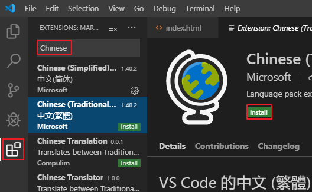
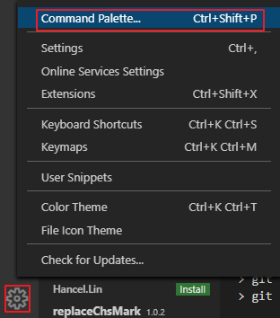
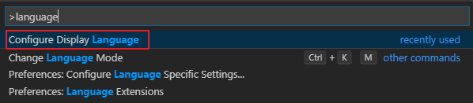
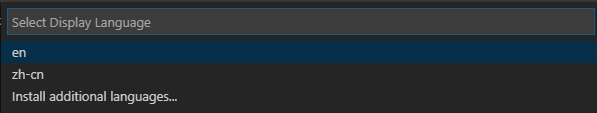

# VS Code修改显示语言

---

## 1. 第一次安装VS Code，还未安装语言包

直接点击 Extensions 按钮(Ctrl + Shift + x)中搜索需要的语言包（需要联网），点击安装即可。安装后右下角会提示是否重启，重启后生效

## 2. 已安装语言包，想要切换语言

点击左下角 manage 按钮，选择 Command Palette 命令面板（Ctrl + Shift + p），搜索 language。选择 Config Display Language 配置显示语言。

然后会出现已有的语言包，点击相应语言包切换即可（en为英语，zh-cn为简体中文，zh-tw为繁体中文）

